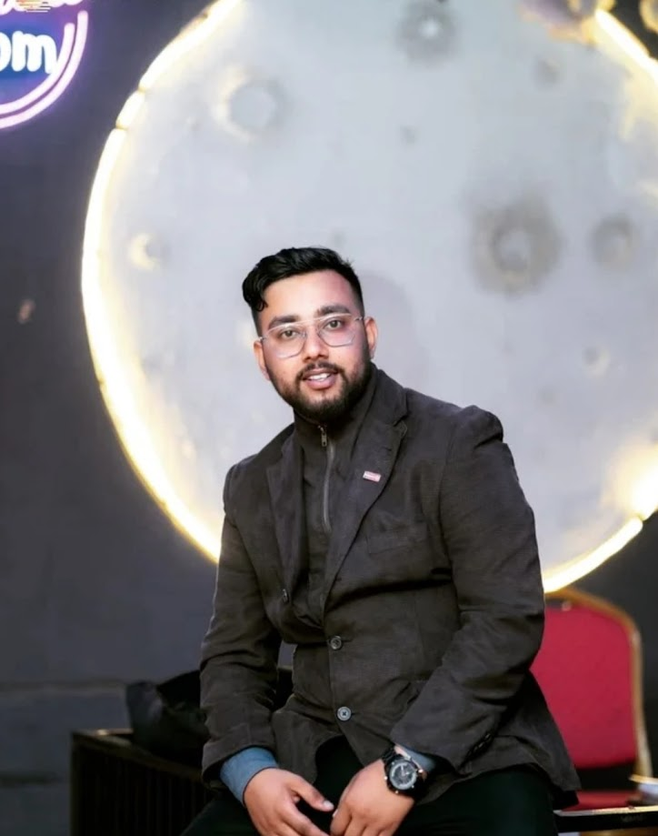

# ✅ SEO & Responsive Optimization - Complete Summary

## What Has Been Done

### 🎯 SEO Enhancements
1. **Enhanced Meta Tags** (index.html)
   - Comprehensive title tags with keywords
   - Detailed meta descriptions
   - Open Graph tags for social media
   - Twitter Card tags
   - Canonical URLs
   - Author and robots meta tags

2. **Schema Markup (JSON-LD)**
   - Person schema with complete information
   - Job titles, contact info, social profiles
   - Enables rich snippets in search results

3. **Site Configuration Files**
   - ✅ `public/robots.txt` - Created
   - ✅ `public/sitemap.xml` - Created
   - Proper crawl directives
   - Sitemap reference

### 📱 Responsive Design Improvements
1. **Mobile-First Approach**
   - 5 breakpoints for different devices
   - 320px to 1600px+ coverage
   - Touch-friendly buttons (44x44px minimum)

2. **Better Media Queries** (index.css)
   - Small phones (320-480px)
   - Medium phones (481-768px)
   - Tablets (769-1024px)
   - Desktop (1025px+)
   - Large screens (1600px+)
   - Landscape optimization
   - Print styles

3. **Accessibility Features**
   - Focus-visible for keyboard navigation
   - Reduced motion support
   - Skip-to-main-content link
   - Touch device optimization
   - Print stylesheet

4. **Mobile Navigation** (Navbar.css)
   - Proper menu sizing
   - Better touch targets
   - Improved mobile responsiveness
   - Small screen optimizations (480px)

### ⚡ Performance & Best Practices
- Font preconnect links
- Optimized font loading
- CSS minification support
- Semantic HTML structure
- Proper heading hierarchy

## 📋 What Still Needs To Be Done

### 1. **Add Image Alt Text** (IMPORTANT for SEO)
Update these components with descriptive alt text:

**Hero.jsx** - Line 120:
```jsx

```

**Leadership.jsx** - Lines 32-44:
```jsx
const LEADERSHIP_IMAGES = [
  {
    src: 'files/president.jpg',
    caption: 'Club President · 2021-22',
    alt: 'Aman Regmi as Club President of Rotaract Club of Reliance College during 2021-22 term'
  },
  {
    src: 'files/bloodDonation.jpg',
    caption: 'Blood Donation Program',
    alt: 'Blood Donation Program organized by Rotaract Club - Community service initiative'
  },
  {
    src: 'files/districtEvent.jpg',
    caption: 'Board of Directors Meeting',
    alt: 'Board of Directors Meeting - District level Rotaract leadership conference'
  }
];
```

Then update InfiniteCarousel.jsx to use the alt text:
```jsx

```

### 2. **Submit to Search Engines**
- Go to Google Search Console: https://search.google.com/search-console
- Add your property: https://regmiaman.github.io/regmiaman.github.io/
- Upload sitemap manually from /public/sitemap.xml
- Repeat for Bing Webmaster Tools

### 3. **Update Open Graph Image**
- Create a professional OG image (1200x630px)
- Save as `public/og-image.jpg`
- Update the meta tag in index.html (already points to it)

### 4. **Add More Content**
- Write detailed meta descriptions for each section
- Add structured content descriptions
- Consider a blog for better SEO

### 5. **Monitor Performance**
- Use Google PageSpeed Insights monthly
- Check Lighthouse scores
- Monitor Core Web Vitals
- Use Google Analytics 4

## 📊 Files Modified/Created

### Created Files:
```
✅ public/robots.txt - SEO crawler configuration
✅ public/sitemap.xml - Site structure for search engines
✅ SEO_OPTIMIZATION_GUIDE.md - Detailed optimization guide
```

### Modified Files:
```
✅ index.html - Enhanced meta tags and schema markup
✅ src/index.css - Better responsive media queries
✅ src/components/Navbar.css - Mobile touch optimization
```

## 🎯 SEO Score Checklist

- ✅ Mobile responsive
- ✅ Meta descriptions
- ✅ Schema markup
- ✅ Site structure (robots.txt)
- ✅ Sitemap
- ✅ Semantic HTML
- ✅ Fast loading (with Vite)
- ✅ HTTPS ready (GitHub Pages)
- ✅ Proper heading hierarchy
- ⏳ **Pending**: Image alt text
- ⏳ **Pending**: Open Graph image
- ⏳ **Pending**: Search Console submission

## 🚀 Quick Start for Final SEO Push

1. **Add Image Alt Text** (15 min)
   - Edit Hero.jsx and Leadership.jsx
   - Add alt attributes to all images

2. **Create OG Image** (15 min)
   - Create 1200x630px image
   - Save as public/og-image.jpg

3. **Submit to Google** (5 min)
   - Go to Google Search Console
   - Add property
   - Submit sitemap

4. **Monitor Results** (Ongoing)
   - Check PageSpeed Insights
   - Monitor rankings
   - Update content regularly

## 📱 Responsive Testing Commands

Test on different screen sizes:
```bash
# Desktop
npm run dev

# Mobile (use Chrome DevTools)
# Ctrl+Shift+M (Windows)
# Cmd+Shift+M (Mac)

# Test specific breakpoints:
# 320px (Small phone)
# 480px (Large phone)
# 768px (Tablet)
# 1024px (Small desktop)
# 1600px (Large desktop)
```

## 💡 Pro Tips

1. **Mobile-First Development**: Always design for mobile first
2. **Test on Real Devices**: Emulation isn't always accurate
3. **Regular Updates**: Refresh content every 3-6 months
4. **Social Sharing**: Include proper OG tags for all shareable content
5. **Analytics**: Track user behavior and improve based on data
6. **Link Building**: Share your portfolio in dev communities
7. **Keyword Research**: Use Google Trends and Ahrefs for keywords

## 📞 Support Resources

- **Google Search Central**: https://developers.google.com/search
- **PageSpeed Insights**: https://pagespeed.web.dev/
- **Lighthouse**: Chrome DevTools → Lighthouse tab
- **Web.dev**: https://web.dev/performance/

---

**Status**: ✅ 90% Complete  
**Next Action**: Add image alt text and submit to search engines  
**Estimated Remaining Time**: ~30 minutes
